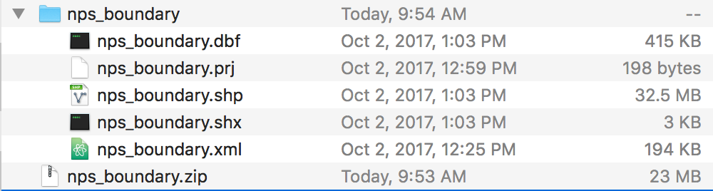
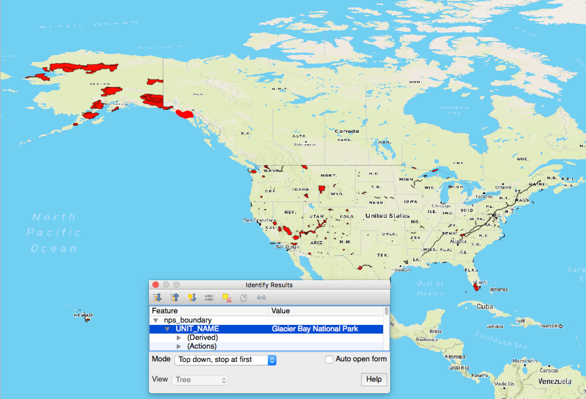

# National Park Service Shapefiles

Looking for shapefile administrative boundaries for the National Park Service?  Meet [IRMA.nps.gov](https://irma.nps.gov/Portal)

Following this link yielded `nps_boundary.zip`.

[https://irma.nps.gov/DataStore/Reference/Profile/2225713?lnv=True](https://irma.nps.gov/DataStore/Reference/Profile/2225713?lnv=True)

##### Recently updated



#### View of Available Units



---

#### Example Properties

``` json
"properties":{
   "UNIT_CODE":"CABR",
   "GIS_Notes":"Lands - http://landsnet.nps.gov/tractsnet/documents/CABR/Metadata/cabr_metadata.xml",
   "UNIT_NAME":"Cabrillo National Monument",
   "DATE_EDIT":"2008-08-28",
   "STATE":"CA",
   "REGION":"PW",
   "GNIS_ID":"255957",
   "UNIT_TYPE":"National Monument",
   "CREATED_BY":"Lands",
   "METADATA":"https://irma.nps.gov/App/Reference/Profile/1047918#Cabrillo National Monument",
   "PARKNAME":"Cabrillo"
}
```
